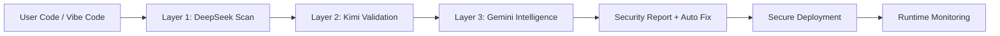

<!-- ===================== VISCOvaAI ULTRA ELITE ===================== -->

 

  

---

# 🧠 What is ViscovaAI?

**ViscovaAI** is an AI-native security platform purpose-built for the new era of **vibe coding and AI-assisted software development**.

As AI rapidly becomes responsible for writing production code, traditional security tooling is struggling to keep up. ViscovaAI introduces a **consensus-driven multi-model security architecture** that continuously analyzes, validates, and protects applications from the moment of creation through live production environments.

> **Our thesis:** the future of software is AI-assisted — and security must evolve ahead of it.

---

# ⚡ Platform Capabilities

## 🔐 Intelligent Code Security

ViscovaAI performs deep semantic analysis to detect:

* exposed API keys and secrets
* unsafe authentication flows
* injection vulnerabilities
* dependency risks
* insecure configurations
* AI-generated anti-patterns

Each finding includes **production-ready remediation guidance**.

---

## 🧩 Three-Layer AI Consensus Engine

Unlike single-model scanners, ViscovaAI uses **multi-AI cross-validation**.

| Layer       | Engine   | Responsibility                     |
| ----------- | -------- | ---------------------------------- |
| **Layer 1** | DeepSeek | Structural vulnerability discovery |
| **Layer 2** | Kimi     | Validation & secure remediation    |
| **Layer 3** | Gemini   | Holistic security intelligence     |

✅ Lower false positives
✅ Higher confidence
✅ Production trust

---

## 🛡️ Active Runtime Protection

Security continues after deployment:

* real-time threat monitoring
* behavioral anomaly detection
* API abuse protection
* adaptive risk scoring
* continuous security reassessment
* self-healing guidance

---

## ☁️ Deployment & Cloud Intelligence

Before production, ViscovaAI validates:

* environment variable exposure
* cloud misconfigurations
* HTTPS & header posture
* compliance signals
* production readiness score

---

# 🏗️ Viscova Ecosystem

| System                  | Role                         |
| ----------------------- | ---------------------------- |
| 🧠 **Viscova Brain**    | AI security analysis backend |
| 🛡️ **Viscova Shield**  | Runtime protection engine    |
| ⚙️ **Viscova Core**     | Multi-AI consensus engine    |
| 🌐 **Viscova Platform** | Full SaaS experience         |

---

# 🧭 High-Level Architecture

---

# 🧪 Technology Direction

---

# 📈 Project Activity

---

# 🐍 Contribution Graph

*(Snake appears after GitHub Action is added — I can help you enable it.)*

---

# 🎯 Mission

> **Secure the AI-generated software revolution.**

---

# 🌍 Long-Term Vision

ViscovaAI is building toward becoming the **default security layer for AI-generated applications worldwide**, serving:

* independent developers
* AI-first startups
* enterprise DevSecOps teams
* platform builders

---

# 🤝 Contributing

We welcome serious builders in:

* AI security
* DevSecOps
* full-stack systems
* applied machine learning

Open an issue or discussion to collaborate.

---

# ⭐ Support the Vision

If ViscovaAI resonates with you:

* ⭐ Star the repositories
* 👁️ Watch the organization
* 🔁 Share with builders

---

## 🚀 Building the Security Layer for the AI Era

**ViscovaAI**

<!-- ===================== END ULTRA ELITE ===================== -->
